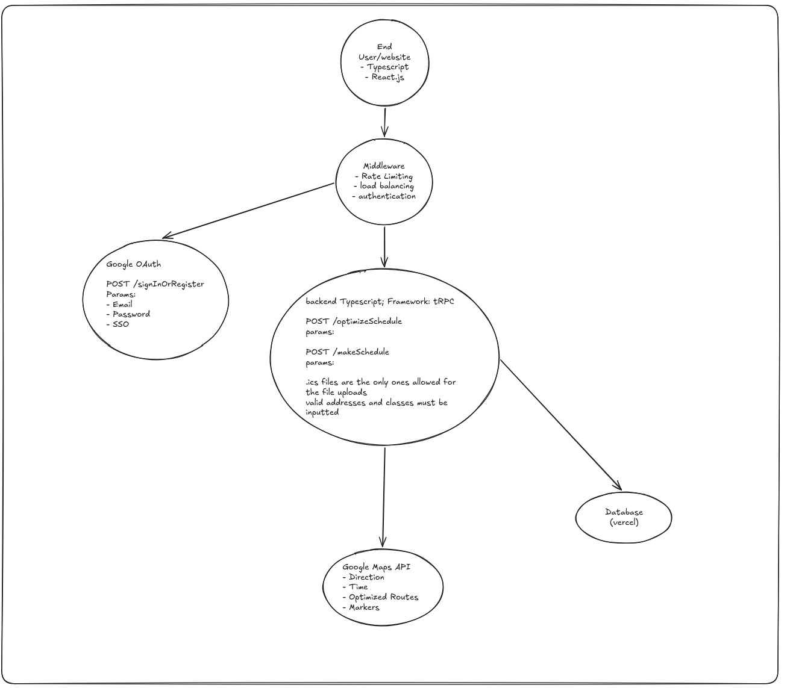

# ASU_Navigator Project
Project Description:
The project will allow students to upload their schedules to derive the most time-efficient method for traveling to each class to help college students find the locations of their classes.

Dependencies:
Google Maps API Key can be obtained here: https://developers.google.com/maps/documentation/javascript/get-api-key

Set up end file:

How to run:

Front-end:
pnpm install
pnpm run dev

Back-end:
npx prisma migrate dev
npx prisma generate
pnpm install
pnpm install axios
pnpm run dev

To run fixBuildingCoords.js script:
cd .\ASU_Navigator\scripts
node fixBuildingCoords.js
Should create a new file with accurate building coordinates in a .json file

Tech Stack:
- frontend: HTML/CSS/TS
- backend: tRPC
    - typescript is well-supported by google maps docs & sdk
    - having everything in one language is nice
    - Using tRPC may be a good choice due to the ability to easily prevent having to repeat yourself through the middleware, wrappers, and other syntactic elements.
    - less bloated than other full-fledged frameworks
- authentication: login with google
    - simple, just need to check if they’re logged in with ASU email
- infra/platform: docker
    - nice to make sure everyone is running on the same environment
- external datasource: Google Maps API

